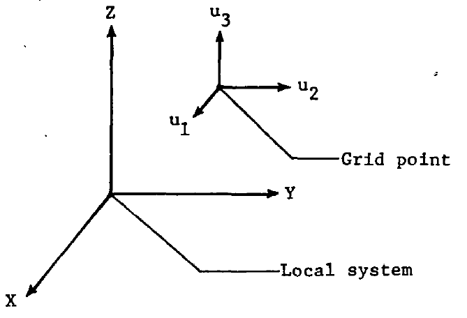
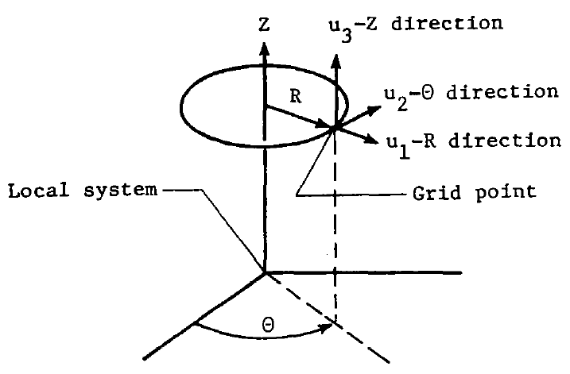
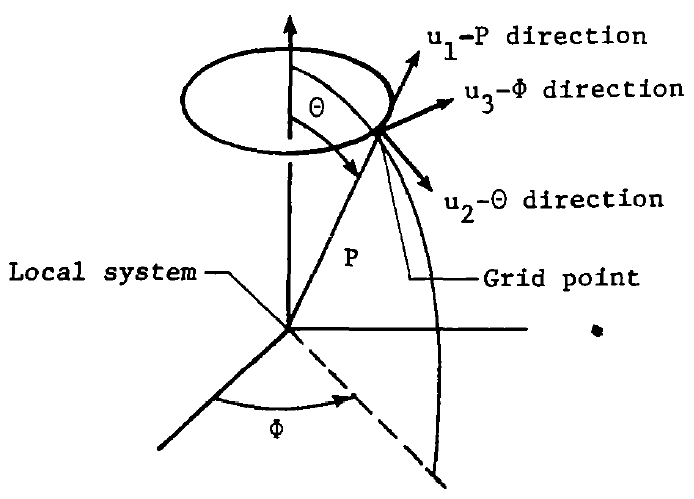
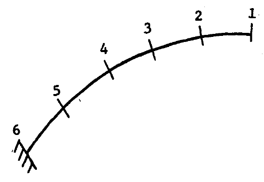
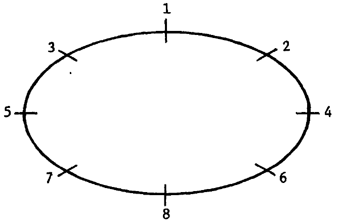
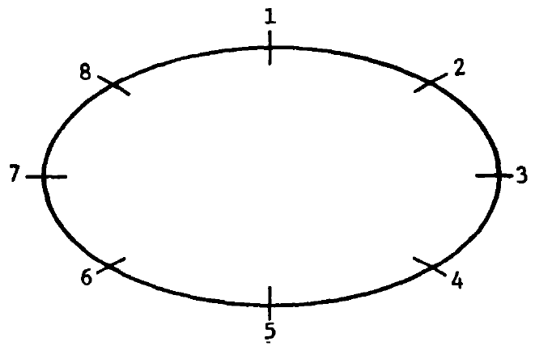
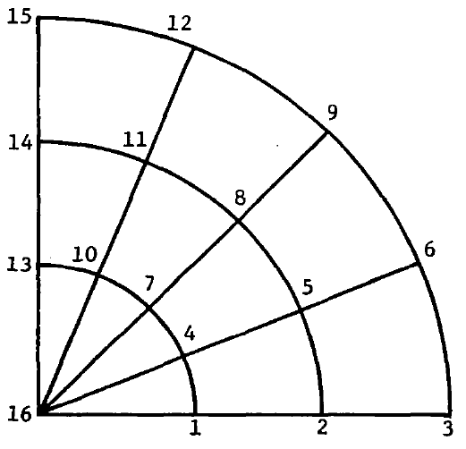
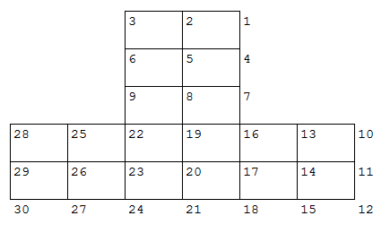

# Introduction

NASTRAN embodies a lumped element approach, wherein the distributed
physical properties of a structure are represented by a model
consisting of a finite number of idealized substructures or elements
that are interconnected at a finite number of grid points, to which
loads are applied. All input and output data pertain to the idealized
structural model. The major components in the definition and loading
of a structural model are indicated in Figure 1.1-1.

As indicated in Figure 1.1-1, the grid point definition forms the
basic framework for the structural model. All other parts of the
structural model are referenced either directly or indirectly to the
grid points.

Two general types of grid points are used in defining the structural
model. They are:

1. Geometric grid point - a point in three-dimensional space at which
   three components of translation and three components of rotation
   are defined. The coordinates of each grid point are specified by
   you.
2. Scalar point - a point in vector space at which one degree of
   freedom is defined. Scalar points can be coupled to geometric grid
   points by means of scalar elements and by constraint relationships.

The structural element is a convenient means for specifying many of
the properties of the structure, including material properties, mass
distribution, and some types of applied loads. In static analysis by
the displacement method, stiffness properties are input exclusively by
means of structural elements. Mass properties (used in the generation
of gravity and inertia loads) are input either as properties of
structural elements or as properties of grid points. In dynamic
analysis, mass, damping, and stiffness properties may be input either
as the properties of structural elements or as the properties of grid
points (direct input matrices).

Structural elements are defined on connection cards by referencing
grid points, as indicated on Figure 1.1-1. In a few cases, all of the
information required to generate the structural matrices for the
element is given on the connection card. In most cases the connection
card refers to a property card, on which the cross-sectional
properties of the element are given. The property card in turn refers
to a material card which gives the material properties. If some of the
material properties are stress dependent or temperature dependent, a
further reference is made to tables for this information.

Various kinds of constraints can be applied to the grid
points. Single- point constraints are used to specify boundary
conditions, including enforced displacements of grid
points. Multipoint constraints and rigid elements are used to specify
linear relationships among selected degrees of freedom. Omitted
points are used as a tool in matrix partitioning and for reducing the
number of degrees of freedom used in dynamic analysis. Free-body
supports are used to remove stress-free motions in static analysis and
to evaluate the free-body inertia properties of the structural model.

Static loads may be applied to the structural model by concentrated
loads at grid points, pressure loads on surfaces, or indirectly, by
means of the mass and thermal expansion properties of structural
elements or enforced deformations of one-dimensional structural
elements. Due to the great variety of possible sources for dynamic
loading, only general forms of loads are provided for use in dynamic
analysis.

The following sections describe the general procedures for defining
structural models. Detailed instructions for each of the bulk data
cards and case control cards are given in Section 2. Additional
information on the case control cards and use of parameters is given
for each rigid format in Section 3.

**Figure 1.1-1. Structural model**

# Grid Points

## Grid Point Definition

Geometric grid points are defined on GRID bulk data cards by
specifying their coordinates in either the basic or a local coordinate
system. The implicitly defined basic coordinate system is rectangular,
except when using axisymmetric elements. Local coordinate systems may
be rectangular, cylindrical, or spherical. Each local system must be
related directly or indirectly to the basic coordinate system. The
CORD1C, CORD1R, and CORD1S cards are used to define cylindrical,
rectangular, and spherical local coordinate systems, respectively, in
terms of three geometric grid points which have been previously
defined. The CORD2C, CORD2R, and CORD2S cards are used to define
cylindrical, rectangular, and spherical local coordinate systems,
respectively, in terms of the coordinates of three points in a
previously defined coordinate system.

Six rectangular displacement components (3 translations and 3
rotations) are defined at each grid point. The local coordinate system
used to define the directions of motion may be different from the
local coordinate system used to locate the grid point. Both the
location coordinate system and the displacement coordinate system are
specified on the GRID card for each geometric grid point. The
orientation of displacement components depends on the type of local
coordinate system used to define the displacement components. If the
defining local system is rectangular, the displacement system is
parallel to the local system and is independent of the grid point
location as indicated in Figure 1.2-1a. If the local system is
cylindrical, the displacement components are in the radial,
tangential, and axial directions as indicated in Figure 1.2-1b. If the
local system is spherical, the displacement components are in the
radial, meridional, and azimuthal directions as indicated in Figure
1.2-1c. Each geometric grid point may have a unique displacement
coordinate system associated with it. The collection of all
displacement coordinate systems is known as the global coordinate
system. All matrices are formed and all displacements are output in
the global coordinate system. The symbols T1, T2, and T3 on the
printed output indicate translations in the 1, 2, and 3-directions,
respectively, for each grid point. The symbols R1, R2, and R3
indicate rotations (in radians) about the three axes.

Provision is also made on the GRID card to apply single-point
constraints to any of the displacement components. Any constraints
specified on the GRID card will be automatically used for all
solutions. Constraints specified on the GRID card are usually
restricted to those degrees of freedom that will not be elastically
constrained and hence must be removed from the model in order to avoid
singularities in the stiffness matrix.

The GRDSET card is provided to avoid the necessity of repeating the
specification of location coordinate systems, displacement coordinate
systems, and single-point constraints, when all, or many, of the GRID
cards have the same entries for these items. When any of the three
items are specified on the GRDSET card, the entries are used to
replace blank fields on the GRID card for these items. This feature is
useful in the case of such problems as space trusses where one wishes
to remove all of the rotational degrees of freedom or in the case of
plane structures where one wishes to remove all of the out-of-plane or
all of the in-plane motions.

Scalar points are defined either on an SPOINT card or by reference on
a connection card for a scalar element. SPOINT cards are used
primarily to define scalar points appearing in constraint equations,
but to which no structural elements are connected. A scalar point is
implicitly defined if it is used as a connection point for any scalar
element. Special scalar points, called "extra points", may be
introduced for dynamic analyses. Extra points are used in connection
with transfer functions and other forms of direct matrix input used in
dynamic analyses and are defined on EPOINT cards.

GRIDB is a variation of the GRID card that is used to define a point
on a fluid-structure interface (see Section 1.7).

*(a) Rectangular*

*(b) Cylindrical*

*(c) Spherical*

**Figure 1.2-1. Displacement coordinate systems**

## Grid Point Sequencing

The external identification numbers used for grid points may be
selected in any manner you desire. However, in order to reduce the
number of active columns, and, hence, to substantially reduce
computing times when using the displacement method, the internal
sequencing of the grid points must not be arbitrary. The best
decomposition and equation solution times are obtained if the grid
points are sequenced in such a manner as to create matrices having
small numbers of active columns (see Section 2.2 of the Theoretical
Manual for a discussion of active columns and the decomposition
algorithm). The decomposition time is proportional to the sum of the
squares of the number of active columns in each row of the triangular
factor. The equation solution time (forward/backward substitution) is
proportional to the number of nonzero terms in the triangular factor.

## Manual Grid Point Resequencing

In order to allow arbitrary grid point numbers and still preserve
sparsity in the triangular decomposition factor to the greatest extent
possible, provision is made for you to resequence the grid point
numbers for internal operations. This feature also makes it possible
to easily change the sequence if a poor initial choice is made. All
output associated with grid points is identified with the external
grid point numbers. The SEQGP card is used to resequence geometric
grid points and scalar points. The SEQEP card is used to sequence the
extra points in with the previously sequenced grid points and scalar
points.

In selecting the grid point sequencing, it is not important to find
the best sequence; rather it is usually quite satisfactory to find a
good sequence, and to avoid bad sequences that create unreasonably
large numbers of active columns. For many problems a sequence which
will result in a band matrix is a reasonably good choice, but not
necessarily the best. Also, sequences which result in small numbers of
columns with nonzero terms are usually good but not necessarily the
best. A sequence with a larger number of nonzero columns will
frequently have a smaller number of nonzero operations in the
decomposition when significant passive regions exist within the active
columns (see Section 2.2 of the Theoretical Manual).

Examples of proper grid point sequencing for one-dimensional systems
are shown in Figure 1.2-2. For open loops, a consecutive numbering
system should be used as shown in Figure 1.2-2a. This sequencing will
result in a narrow band matrix with no new nonzero terms created
during the triangular decomposition. Generally, there is an
improvement in the accumulated round off error if the grid points are
sequenced from the flexible end to the stiff end.

For closed loops, the grid points may be sequenced either as shown in
Figure 1.2-2b or as shown in Figure 1.2-2c. If the sequencing is as
shown in Figure 1.2-2b, the semiband will be twice that of the model
shown in Figure 1.2-2a. The matrix will initially contain a number of
zeroes within the band which will become nonzero as the decomposition
proceeds. If the sequencing is as shown in Figure 1.2-2c, the band
portion of the matrix will be the same as that for Figure
1.2-2a. However, the connection between grid points 1 and 8 will
create a number of active columns on the right hand side of the
matrix. The solution times will be the same for the sequence shown in
Figure 1.2-2b or 1.2-2c, because the number of active columns in each
sequence is the same.

Examples of grid point sequencing for surfaces are shown in Figure
1.2-3. For plain or curved surfaces with a pattern of grid points
that tends to be rectangular, the sequencing shown in Figure 1.2-3a
will result in a band matrix having good solution times. The semiband
will be proportional to the number of grid points along the short
direction of the pattern. If the pattern of grid points shown in
Figure 1.2-3a is made into a closed surface by connecting grid points
1 and 17, 2 and 18, etc., a number of active columns equal to the
semiband will be created. If the number of grid points in the
circumferential direction is greater than twice the number in the
axial direction, the sequencing indicated in Figure 1.2-3a is a good
one. However, if the number of grid points in the circumferential
direction is less than twice the number in the axial direction, the
use of consecutive numbering in the circumferential direction is more
efficient. An alternate sequencing for a closed loop is shown in
Figure 1.2-3b, where the semiband is proportional to twice the number
of grid points in a row. For cylindrical or similar closed surfaces,
the sequencing shown in Figure 1.2-3b has no advantage over that shown
in Figure 1.2-3a, as the total number of active columns will be the
same in either case.

With the exception of the central point, sequencing considerations for
the radial pattern shown in Figure 1.2-3c are similar to those for the
rectangular patterns shown in Figures 3a and 3b. The central point
must be sequenced last in order to limit the number of active columns
associated with this point to the number of degrees of freedom at the
central point. If the central point is sequenced first, the number of
active columns associated with the central point will be proportional
to the number of radial lines. If there are more grid points on a
radial line than on a circumferential line, the consecutive numbering
should extend in the circumferential direction beginning with the
outermost circumferential ring. In this case, the semiband is
proportional to the number of grid points on a circumferential line
and there will be no active columns on the right hand side of the
matrix. If the grid points form a full circular pattern, the closure
will create a number of active columns proportional to the number of
grid points on a radial line if the grid points are numbered as shown
in Figure 1.2-3c. Proper sequencing for a full circular pattern is
similar to that discussed for the rectangular arrays shown in Figures
3a and 3b for closed surfaces.

Sequencing problems for actual structural models can frequently be
handled by considering the model as consisting of several
substructures. Each substructure is first numbered in the most
efficient manner. The substructures are then connected so as to create
the minimum number of active columns. The grid points at the interface
between two substructures are usually given numbers near the end of
the sequence for the first substructure and as near the beginning of
the sequence for the second substructure as is convenient.

Figure 1.2-4 shows a good sequence for the substructure approach. Grid
points 1 through 9 are associated with the first substructure, and
grid points 10 through 30 are associated with the second
substructure. In the example, each of the substructures was sequenced
for band matrices. However, other schemes could also be considered for
sequencing the individual substructures. Figure 1.2-5 shows the
nonzero terms in the triangular factor. The X's indicate terms which
are nonzero in the original matrix. The zeros indicate nonzero terms
created during the decomposition. The maximum number of active columns
for any pivotal row is only five, and this occurs in only three rows
near the middle of the matrix for the second substructure. All other
pivotal rows have four or less active columns.

Figure 1.2-6 indicates the grid point sequencing using substructuring
techniques for a square model, and Figure 1.2-7 shows the nonzero
terms in the triangular factor. If the square model were sequenced for
a band matrix, the number of nonzero terms in the triangular factor
would be 129, whereas Figure 1.2-7 contains only 102 nonzero
terms. The time for the forward/backward substitution operation is
directly proportional to the number of nonzero terms in the triangular
factor. Consequently, the time for the forward/backward substitution
operation when the square array is ordered as shown in Figure 1.2-7 is
only about 80% of that when the array is ordered for a band matrix.
The number of multiplications for a decomposition when ordered for a
band is 294, whereas the number indicated in Figure 1.2-7 is
only 177. This indicates that the time for the decomposition when
ordered as shown in Figure 1.2-6 is only 60% of that when ordered for
a band.

Although scalar points are defined only in vector space, the pattern
of the connections is used in a manner similar to that of geometric
grid points for sequencing scalar points among themselves or with
geometric grid points. Since scalar points introduced for dynamic
analysis (extra points) are defined in connection with direct input
matrices, the sequencing of these points is determined by direct
reference to the positions of the added terms in the dynamic matrices.

*(a) Consecutive numbering system for open loops.*

*(b) Sequencing of grid points for a closed loop (method 1).*

*(c) Sequencing of grid points for a closed loop (method 2).*

**Figure 1.2-2. Grid point sequencing for one-dimensional systems**

*(a) Grid-point sequencing for a rectangular surface (method 1).*

*(b) Grid-point sequencing for a rectangular surface (method 2).*

*(c) Grid-point sequencing for a radial pattern.*

**Figure 1.2-3. Grid point sequencing for surfaces**

**Figure 1.2-4. Grid point sequencing for substructures**

>     X X   X
>       X X 0 X
>         X 0 0 X
>           X X 0 X
>             X X 0 X
>               X 0 0 X
>                 X X 0             X
>                   X X             0     X
>                     X             0     0     X
>                       X X   X
>                         X X 0 X
>                           X 0 0 X
>                             X X 0 X
>                               X X 0 X
>                                 X 0 0 X
>                                   X X 0 X     0
>                                     X X 0 X   0
>                                       X 0 0 X 0
>                                         X X 0 X
>                                           X X 0 X
>          (Symmetric)                        X 0 0 X
>                                               X X 0 X
>                                                 X X 0 X
>                                                   X 0 0 X
>                                                     X X 0 X
>                                                       X X 0 X
>                                                         X 0 0 X
>                                                           X X 0
>                                                             X X
>                                                               X

**Figure 1.2-5. Matrix for substructure example**

**Figure 1.2-6. Grid point sequencing for square model**

>          X X X
>            X 0 X                             X
>              X X                         X   0
>                X                         0 X 0 X
>                  X X X
>                    X 0 X                     X
>                      X X                     0   X
>                        X                     0 X 0 X
>                          X X X
>                            X 0 X                     X
>                              X X                 X   0
>                                X                 0 X 0 X
>                                  X X X
>                                    X 0 X             X
>                                      X X X           0
>                                        X 0 X         0 X
>               (Symmetric)                X X 0 0
>                                            X 0 0     0 0 X
>                                              X X 0 0 0 0 0
>                                                X 0 0 0 0 X
>                                                  X X 0 0 0
>                                                    X 0 0 X
>                                                      X X 0
>                                                        X X
>                                                          X

**Figure 1.2-7. Matrix for square model example**

## Automatic Grid Point Resequencing Using the BANDIT Procedure

If you want reduced matrix reduction and equation solution times, you
can manually resequence your grid points by the use of SEQGP cards as
per the guidelines outlined in the previous section. However, in order
to relieve you of the burden of having to do so, an automatic
resequencing capability has been provided in NASTRAN. This capability
involves the use of the BANDIT procedure in NASTRAN. (See Reference 1
for details of the BANDIT procedure and Reference 2 for details of the
manner in which it has been implemented in NASTRAN.)

The BANDIT procedure in automatically invoked in NASTRAN for all runs
(except those indicated in Sections 1.2.2.2.2 and 1.2.2.2.3), unless
specifically suppressed by you. (See the description of the BANDIT
options in the next section.) The result of the BANDIT operations is a
set of SEQGP cards that are automatically generated by the
program. These SEQGP cards are added to your input data (replacing any
SEQGP cards already input, if so specified) for subsequent processing
by the program.

### BANDIT Options

The execution of the BANDIT operations in NASTRAN is controlled by
several parameters. These parameters can be specified by means of the
NASTRAN card and are fully described in Section 2.1. All of these
parameters have default values selected so that you normally do not
have to explicitly specify any of them.

NASTRAN provides two methods to skip over the BANDIT
operations. First, the NASTRAN BANDIT = -1 option can be used. The
second method is to include one or more SEQGP cards in the Bulk Data
Deck. In this second method, BANDIT would terminate since you have
already stated your choice of SEQGP resequencing cards. However, the
NASTRAN BANDTRUN = 1 option can be used to force BANDIT to generate
new SEQGP cards to replace the old SEQGP set already in the input Bulk
Data Deck. In all instances when BANDIT is executed, NASTRAN will
issue a page of summary to keep you informed of the basic resequencing
computations. You may refer to Reference 1 for the definition of the
technical terms used.

The BANDIT procedure automatically counts the number of grid points
used in a NASTRAN job and sets up the exact array dimensions needed
for its internal computations. However, if your structural model uses
more grid points in the connecting elements than the total number of
grid points as defined on the GRID cards, BANDIT will issue a fatal
message and terminate the job. In the case where non-active grid
points (that is, grid points defined on the GRID cards but nowhere
used in the model) do exist, BANDIT will add them to the end of the
SEQGP cards, and their presence will not cause termination of a job.
(If necessary, the NASTRAN HICORE parameter can be used on the UNIVAC
version to increase the amount of open core available for the BANDIT
operations.)

Multipoint constraints (MPCs) and rigid elements are included in the
BANDIT computations only when the BANDTMPC = 1 (or 2) option is
selected. (The use of the dependent grid points of MPCs and/or rigid
elements is controlled by the BANDTDEP option.) However, as noted in
Reference 1, it should be emphasized here that only in rare cases
would it make sense to let BANDIT process MPCs and rigid elements. The
main reasons for this are that BANDIT does not consider individual
degrees of freedom and, in addition, cannot distinguish one MPC set
from another.

### Cases for Which BANDIT Computations are Skipped

The BANDIT computations in NASTRAN are unconditionally skipped over if
any of the following conditions exists:

1. There are errors in input data.
2. The Bulk Data Deck contains any of the following types of input:
    - Axisymmetric (CONEAX, TRAPAX, or TRIAAX) elements
    - Fluid (FLUID2, FLUID3, or FLUID4) elements
    - DMI (Direct Matrix Input) data
3. It is a substructure Phase 2 run.

### BANDIT in Restarts

At the beginning of a NASTRAN job, the Preface (or Link 1) modules
read and process the Executive, Case Control, and Bulk Data decks. The
SEQGP cards generated by BANDIT are added directly to the NASTRAN data
base (specifically, the GEOM1 file) at a later stage. Since these
SEQGP cards are not part of the original Bulk Data Deck, they are not
directly written on to the NPTP (New Problem Tape) in a checkpoint run
and, therefore, are not available as such for use on the OPTP (Old
Problem Tape) in a restart.

In the light of the above comments, the following points about the use
of BANDIT in NASTRAN restarts should be noted:

1. BANDIT is automatically skipped if the restart job has no input
   data changes with respect to the checkpoint job. However, the
   previously generated SEQGP cards, if any, are already absorbed into
   the NASTRAN data base (data blocks such as EQEXIN, SIL, etc.). A
   message is printed to inform you that the BANDIT computations are
   not performed. (BANDIT can be executed if the restart job contains
   one or more of the appropriate BANDIT options on the NASTRAN card,
   for example, NASTRAN BANDMTH = 2.)
2. BANDIT is executed (except for the cases indicated in Section
   1.2.2.2.2) if the restart job has input data changes with respect
   to the checkpoint job, unless specifically suppressed by you. (The
   BANDIT = -1 option on the NASTRAN card can be used to stop BANDIT
   execution unconditionally.)

## Grid Point Properties

Some of the characteristics of the structural model are introduced as
properties of grid points, rather than as properties of structural
elements. Any of the various forms of direct matrix input are
considered as describing the structural model in terms of properties
of grid points.

Thermal fields are defined by specifying the temperatures at grid
points. The TEMP card is used to specify the temperature at grid
points for use in connection with thermal loading and
temperature-dependent material properties. The TEMPD card is used to
specify a default temperature, in order to avoid a large number of
duplicate entries on a TEMP card when the temperature is uniform over
a large portion of the structure. The TEMPAX card is used for conical
shell problems.

Mass properties may be input as properties of grid points by using the
concentrated mass element (see Section 5.5 of the Theoretical
Manual). The CONM1 card is used to define a 6x6 matrix of mass
coefficients at a geometric grid point in any selected coordinate
system. The CONM2 card is used to define a concentrated mass at a
geometric grid point in terms of its mass, the three coordinates of
its center of gravity, the three moments of inertia about its center
of gravity, and its three products of inertia, referred to any
selected coordinate system.

In dynamic analysis, mass, damping and stiffness properties may be
provided, in part or entirely, as properties of grid points through
the use of direct input matrices. The DMIG card is used to define
direct input matrices for use in dynamic analysis. These matrices may
be associated with components of geometric grid points, scalar points,
or extra points introduced for dynamic analysis. The TF card is used
to define transfer functions that are internally converted to direct
matrix input. The DMIAX card is an alternate form of direct matrix
input that is used for hydroelastic problems (see Section 1.7).

## References

1. Everstine, G. C., "BANDIT User's Guide", COSMIC Program
   No. DOD-00033, May 1978.
2. Chan, G. C., "BANDIT in NASTRAN," Eleventh NASTRAN Users'
   Colloquium, NASA Conference Publication, May 1983, San Francisco,
   California, pp. 1-5.
